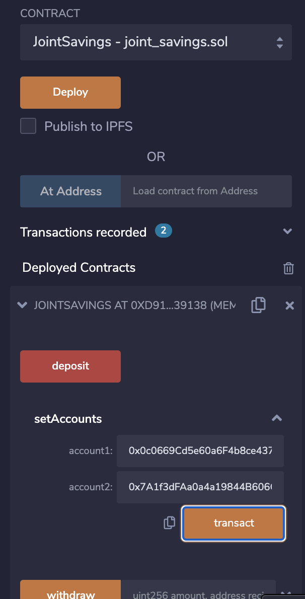
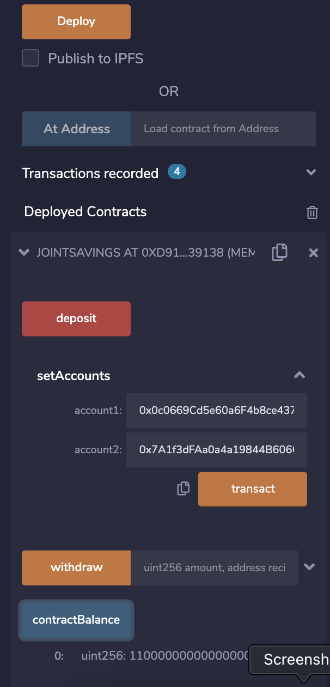
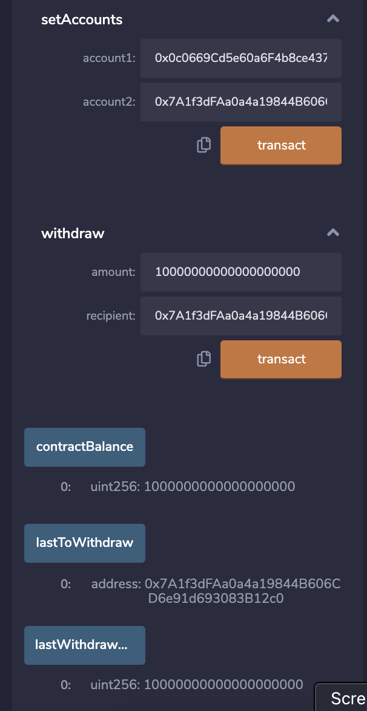
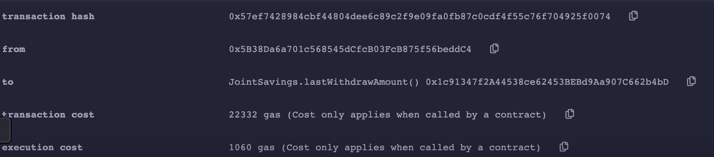

# Ethereum Smart Contract

A fintech startup company has recently hired you. This company is disrupting the finance industry with its own cross-border, Ethereum-compatible blockchain that connects financial institutions. Currently, the team is building smart contracts to automate many of the institutions’ financial processes and features, such as hosting joint savings accounts.

To automate the creation of joint savings accounts, you’ll create a Solidity smart contract that accepts two user addresses. These addresses will be able to control a joint savings account. Your smart contract will use ether management functions to implement a financial institution’s requirements for providing the features of the joint savings account. These features will consist of the ability to deposit and withdraw funds from the account.

---

## Technologies

* [RemiX IDE](https://remix.ethereum.org) - Use the Remix IDE to build and test smart contracts that you create with Solidity. Because you’ll use the web version of this IDE, you don’t need to install any software for this module.

---

## Usage

The following should be created: 

- A completed Solidity JointSavings smart contract.

- A folder named Execution_Results that contains images that confirm deposit and withdrawal transactions, which are designed to test the JointSavings functionality in the JavaScript VM, worked as expected.

## Outcome 

#### setAccounts: 

#### Deposit: 

#### Withdrawl:

#### Terminal Output: 

---

## Contributors

Brought to you by Edgar Coronado

---

## License

MIT